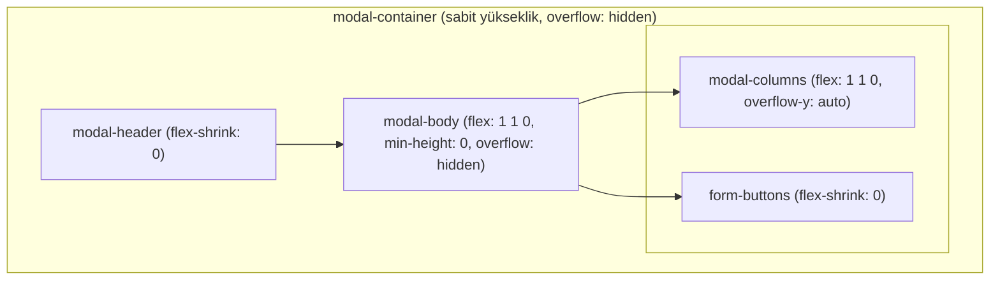

# Masaüstü kayıt modalı: İlk ekranda her şey + Kaydet/Vazgeç görünsün

## Mevcut durum

- **Yapı (HTML):** [index.html](c:\Users\Akel\Desktop\medisa\Cursor\index.html) içinde `#vehicle-modal` → `.modal-container` → `.modal-header` + `.modal-body` (içinde `.modal-columns` + `.form-buttons`).
- **style-core.css:** `.modal-overlay .modal-container` zaten `display: flex; flex-direction: column;` ve sabit `max-height: calc(100vh - ... - 52px)`; `.modal-body` ise `flex: 1; overflow-y: auto` (içerik uzunsa body scroll ediyor).
- **kayit.css:** `#vehicle-modal` için container’da `height: auto !important` ve `overflow-y: auto` (satır 46–50) ile **tüm kutu** (header + body + butonlar) scroll ediyor. Body için `flex: 0 1 auto` ve `overflow-y: visible` (52–56) var. Sonuç: İçerik uzun olduğunda kullanıcı aşağı kaydırmadan Kaydet/Vazgeç’i göremiyor.

## Hedef (sadece masaüstü)

- Modal açıldığında **ilk ekranda** header + mümkün olduğunca form + **Kaydet/Vazgeç her zaman görünsün**.
- İçerik yüksekliği viewport’u aşarsa **sadece form alanı** (iki sütun) scroll etsin; header ve butonlar sabit kalsın.

## Uygulama planı

Tüm değişiklikler **sadece masaüstü** için, [kayit.css](c:\Users\Akel\Desktop\medisa\Cursor\kayit.css) içindeki `@media (min-width: 641px)` bloğunda yapılacak.

### 1. Container: Scroll kaldır, yükseklik viewport’a sınırlı kalsın

- **Dosya:** [kayit.css](c:\Users\Akel\Desktop\medisa\Cursor\kayit.css)  
- **Konum:** `#vehicle-modal .modal-container` için **global** (dosya başı, satır 46–50) kurallar masaüstünde ezilmeli.  
- **Yapılacak:** Masaüstü medyasında `#vehicle-modal .modal-container` için:
  - `height: auto` yerine **sabit yükseklik**: `height: calc(100vh - max(12px, env(safe-area-inset-top)) - var(--modal-margin-bottom-desktop, 52px))` (veya mevcut max-height ile aynı formül).
  - `overflow-y: auto` → `**overflow: hidden**` (container artık scroll etmesin; içeride sadece body’nin orta kısmı scroll edecek).

### 2. Modal body: Flex column + scroll sadece form alanında

- **Dosya:** [kayit.css](c:\Users\Akel\Desktop\medisa\Cursor\kayit.css)  
- **Konum:** `@media (min-width: 641px)` içinde, mevcut `#vehicle-modal .modal-body` kurallarının olduğu yer (satır 792 civarı).
- **Yapılacak:** `#vehicle-modal .modal-body` için:
  - `display: flex; flex-direction: column;`
  - `flex: 1 1 0; min-height: 0;` (kalan yeri alsın, küçülebilsin)
  - `overflow: hidden` (body’nin kendisi scroll etmesin; scroll sadece içteki `.modal-columns`’ta olacak)
  - Mevcut `flex: 0 1 auto` ve `overflow-y: visible` kaldırılacak / bu değerlerle değiştirilecek.

### 3. Form alanı (iki sütun): Tek scroll bölgesi

- **Dosya:** [kayit.css](c:\Users\Akel\Desktop\medisa\Cursor\kayit.css)  
- **Konum:** Aynı masaüstü medyası içinde.
- **Yapılacak:** `#vehicle-modal .modal-body .modal-columns` için:
  - `flex: 1 1 0; min-height: 0; overflow-y: auto;` (form alanı kalan yeri doldursun, taşarsa sadece burası scroll etsin)
  - Gerekirse `-webkit-overflow-scrolling: touch` ve scrollbar gizleme (mevcut modal body stilleriyle uyumlu) eklenebilir.

### 4. Kaydet/Vazgeç: Her zaman altta sabit

- **Dosya:** [kayit.css](c:\Users\Akel\Desktop\medisa\Cursor\kayit.css)  
- **Konum:** `.form-buttons` zaten `flex-shrink: 0` (satır 540). Masaüstü bloğunda `#vehicle-modal .modal-body .form-buttons` için:
  - `flex-shrink: 0` açıkça bırakılacak (veya tekrar yazılacak), böylece body flex column içinde en altta sabit kalacak.

## Akış özeti (masaüstü)

- Container viewport yüksekliğine sınırlı, scroll yok.
- Body flex column; üstte header, altta butonlar sabit.
- Sadece `modal-columns` (form) scroll eder; böylece ilk ekranda header + bir miktar form + Kaydet/Vazgeç her zaman görünür.

## Dokunulmayacaklar

- Mobil (`max-width: 640px`): Mevcut davranış ve stiller korunacak.
- HTML yapısı değiştirilmeyecek (form-buttons modal-body içinde kalacak).
- style-core.css’teki genel modal kuralları değiştirilmeyecek; sadece kayit.css içinde `#vehicle-modal` için masaüstü override’lar uygulanacak.

## Olası ince ayar

- Form çok uzunsa (çok yüksek çözünürlük vb.) ilk açılışta görünen form miktarı doğal olarak sınırlı olur; kullanıcı orta alanı scroll ederek tüm alanları görür, Kaydet/Vazgeç ise hep altta kalır. İstenirse ileride masaüstünde padding/margin veya font boyutu hafifçe azaltılarak “ilk ekranda daha fazla alan” da hedeflenebilir; bu plan kapsamında yalnızca layout (scroll + sabit footer) düzenlenecek.

